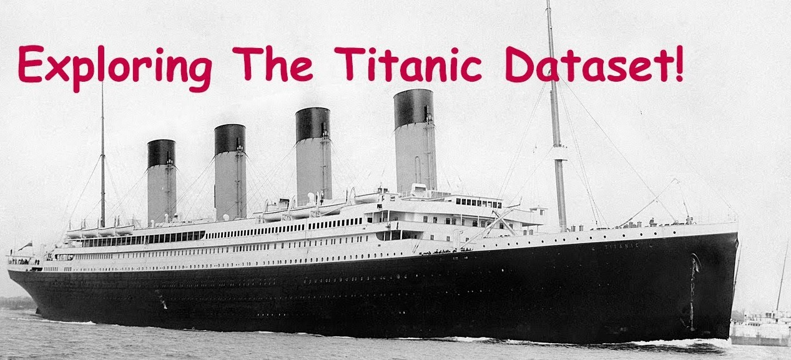
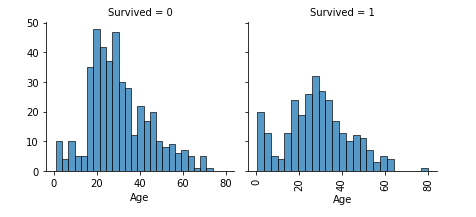
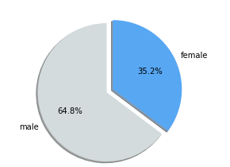
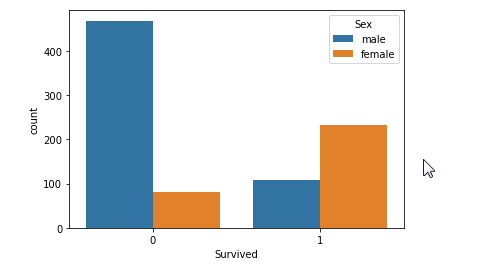
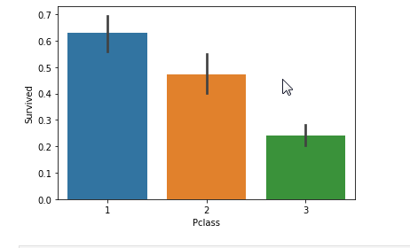
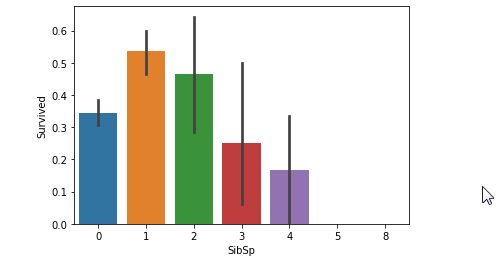

## Exploratory data analysis of US-Accidents dataset

by Nikhil

Data source : Titanic Data : https://www.kaggle.com/abbasit/titanic

Data structure: This csv file include 891 rows and 12 coloumns.

## Motivation
The main motivation behind doing this project was to find all the possible factors that affected a person's survival rate. With the given data. 

## Introduction:

In 1912, the ship RMS Titanic struck an iceberg on its maiden voyage and sank, resulting in the deaths of most of its passengers and crew. This project explores a subset of the RMS Titanic passenger manifest to determine which features best predict whether someone survived or did not survive.
Passengers were divided into three passenger classes determined by the price of their ticket: those travelling in first class, most of them are the wealthiest passengers on board, included prominent members of the upper class, businessmen, politicians, high-ranking military personnel, industrialists, bankers, entertainers, socialites, and professional athletes. Second-class passengers were predominantly middle-class travellers and included professors, authors, clergymen, and tourists. Third-class or steerage passengers were primarily immigrants moving to the United States and Canada."

### Data Analysis:

#### I have only included major Insights below (look at the python notebook for all the findings).

In the analysis of the Titanic dataset, the major question that arises is How many factors affected a person's survival rate? With the given data, this question was broken down into further branches.

A) Did individual characteristics played any role in the survival rate? like:

1. Age

Insight: 
- People in 15 - 40 age group least survived.
- Children below 15 had a good survival rate.

2. Gender

Insight: 
- There were about 65% men and 35% women in the dataset, out of which 75% women survived and only 19% male survived. 

3. Adult or child

Insight: 
- 75% of the passenger were below 40 years old.
- In general, Women & children across all classes had higer survival rates than men.

4. Passenger Class 

Insight: 
- Majority of the ticket sold were of class 3.
- Class 1 passenger survived the most, probably because they paid the sailor off.

B) Which was the location a passenger embarked from? and is there a relation between the embarkment location and the class in which the passenger resided? Perhaps that may tell us something about that place's socio economic condition.

C) Did the survival rate depend on whether the person was travelling alone or with family? If with family, these were the factors:
1. Sibling
2. Parents.

Insight:
- People with 1 siblings survived more, people of largefamily size survived less

### Major Conclusion:

- Sex: Women had better chances of survival than men, more than twice.

- In general, Women & children across all classes had higer survival rates than men.

- Pclass: Pclass-1 had best while Pclass-3 has the worst survival rate.

So we can say, that being a women in Pclass-1 seems to have the best chances of survival. However being a child or woman could not be considered as 100% survival chance.

- Fare: Majority of people died are in the lower fare section.

- Family/Siblings: # Passengers with 1 siblings survived more, passengers having large family size survived least.

- Also, passengers who boarded from Cherbourg survived more as compared to other embarkment ports.

### Software and Libraries

This project uses the following software and Python libraries:

- Python 2.7
- NumPy
- Pandas
- Matplotlib
- Jupyter notebook
